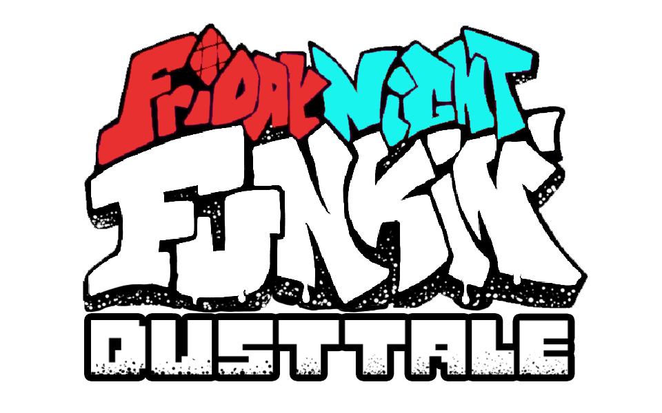

 

# Friday Night Funkin': Dusttale
A Friday Night Funkin mod for your favorite murderer sans.

# Credits
### Friday Night Funkin'
 - [ninjamuffin99](https://twitter.com/ninja_muffin99) - Programming
 - [PhantomArcade3K](https://twitter.com/phantomarcade3k) and [Evilsk8r](https://twitter.com/evilsk8r) - Art
 - [Kawai Sprite](https://twitter.com/kawaisprite) - Music

This game was made with love to Newgrounds and its community. Extra love to Tom Fulp.

### Dusttale
 - [WassabiSoja](https://github.com/WassabiSoja)
 - [StampSz](https://github.com/StampSz)
 - [hexar01](https://github.com/hexar01) 
